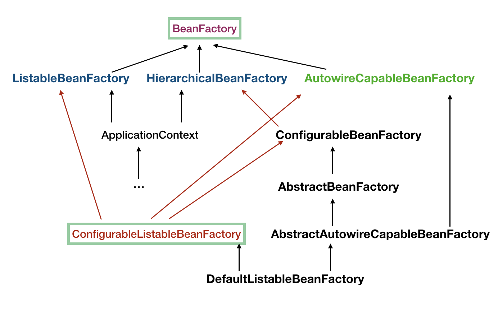
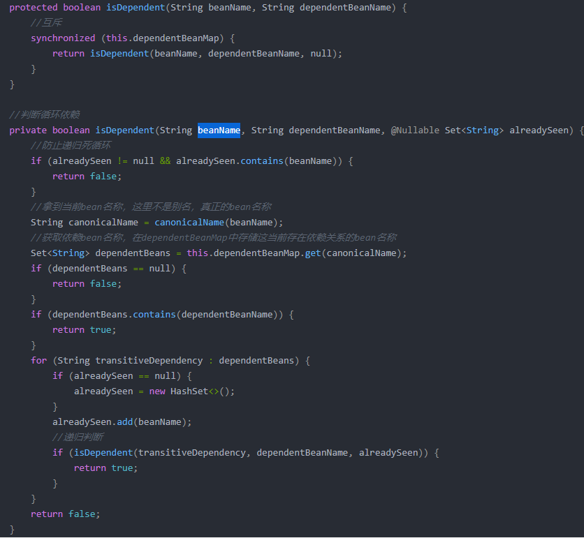
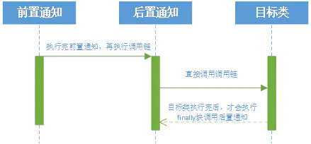

[TOC]

## 概要

[一切框架](https://www.ibm.com/developerworks/cn/java/j-lo-spring-principle/)，都是构建一个数据结构，然后根据这个数据结构设计他的生存环境，并让它在这个环境中按照一定的规律在不停的运动，在它们的不停运动中设计一系列与环境或者与其他个体完成信息交换。

## ApplicationContext

### 描述

作用：核心方法是 `refresh()` 方法，用于从资源文件加载类定义、扩展容器的功能。

应用：

```java
// 早期读取xml配置的bean数据
ApplicationContext context = new ClassPathXmlApplicationContext("classpath:demo.xml");
// 现在通过注解配置bean
AnnotationConfigApplicationContext applicationContext = new AnnotationConfigApplicationContext(DemoApplication.class);
```

继承关系：


### refresh流程

#### 准备工作

记录下容器的启动时间、标记“已启动”状态、处理配置文件中的占位符。

```java
prepareRefresh();
```

#### 创建 BeanFactory

创建 Bean 容器，加载并注册 Bean。将配置文件解析成一个个 Bean 定义，注册到 `BeanFactory` 中。

```java
ConfigurableListableBeanFactory beanFactory = obtainFreshBeanFactory();
```

1. BeanFactory继承关系



2. 该流程的方法实现

```java
// AbstractApplicationContext.java
	protected ConfigurableListableBeanFactory obtainFreshBeanFactory() {
		refreshBeanFactory();
		return getBeanFactory();
	}
```

3. 该流程中涉及的设计模式

   - 简单工厂。实质是由一个工厂类根据传入的参数，动态决定应该创建哪一个产品类。包括：

     1. 各种的Aware接口，比如 `BeanFactoryAware`，对于实现了这些Aware接口的bean，在实例化bean时Spring会帮我们注入对应的`BeanFactory`的实例。

     2. `BeanPostProcessor`接口，实现了`BeanPostProcessor`接口的bean，在实例化bean时Spring会帮我们调用接口中的方法。

     3. `InitializingBean`接口，实现了`InitializingBean`接口的bean，在实例化bean时Spring会帮我们调用接口中的方法。

     4. `DisposableBean`接口，实现了`BeanPostProcessor`接口的bean，在该bean死亡时Spring会帮我们调用接口中的方法。

        > 通过Spring接口的暴露，在实例化bean的阶段我们可以进行一些额外的处理，这些额外的处理只需要让bean实现对应的接口即可，那么spring就会在bean的生命周期调用我们实现的接口来处理该bean。

   - 模板方法1。`AbstractApplicationContext`的`refreshBeanFactory`方法，以`ClassPathXmlApplicationContext`为例，该类最终也是继承了`AbstractRefreshableApplicationContext`的`refreshBeanFactory`方法。

     ```java
     // AbstractRefreshableApplicationContext.java
         @Override
     	protected final void refreshBeanFactory() throws BeansException {
     		if (hasBeanFactory()) {
     			destroyBeans();
     			closeBeanFactory();
     		}
     		try {
              // 初始化DefaultListableBeanFactory，该类基本包含所有BeanFactory的实现
     			DefaultListableBeanFactory beanFactory = createBeanFactory();
      			// 设置 BeanFactory 的两个配置属性：是否允许 Bean 覆盖、是否允许循环引用
     			customizeBeanFactory(beanFactory);
              // 加载 Bean 到 BeanFactory 中。该方法的命名很好，结合了参数。
     			loadBeanDefinitions(beanFactory);
     			this.beanFactory = beanFactory;
     		}
     		}
     	}
     
     ```

   - refresh方式的目的：destroy之前的，create新的。

   - 模板方法2。`AbstractRefreshableApplicationContext`的`loadBeanDefinitions`方法为抽象方法。这里的可扩展性在于，**未对加载方法进行要求，也就是可以从不同来源的不同类型的资源进行加载**。

     ```java
     // AbstractXmlApplicationContext.java
     	@Override
     	protected void loadBeanDefinitions(DefaultListableBeanFactory beanFactory) throws BeansException, IOException {
     		// 给这个 BeanFactory 实例化一个 XmlBeanDefinitionReader.
     		XmlBeanDefinitionReader beanDefinitionReader = new XmlBeanDefinitionReader(beanFactory);
             // 用初始化的 Reader 开始来加载 xml 配置
     		loadBeanDefinitions(beanDefinitionReader);
     	}
     ```

   - 模板方法3。模板方法模式和回调模式的结合，是Template Method不需要继承的一种实现方式。例如，JDBC的抽象和对Hibernate的集成，都采用了一种理念或者处理方式。[JdbcTemplate](https://blog.csdn.net/weixin_40001125/article/details/88538576)

     > 匿名类：如果某个步骤依赖某个操作，该操作只使用一次，为了避免采用注入方式进行依赖。可以采用匿名内部类。
     
     ```java
     // 采用模板方法模式是为了以一种统一而集中的方式来处理资源的获取和释放
     // JdbcTemplate是抽象类，不能够独立使用，我们每次进行数据访问的时候都要给出一个相应的子类实现,这样肯定不方便，所以就引入了回调 。
     public class JdbcTemplate {  
         public final Object execute（StatementCallback callback）{  
             Connection con=null;  
             Statement stmt=null;  
             try{  
                 con=getConnection（）;  
                 stmt=con.createStatement（）;  
                 // 回调，callback类型为StatementCallback
                 Object retValue=callback.doWithStatement(stmt);  
                 return retValue;  
             }catch（SQLException e）{  
                 ...  
             }finally{  
                 closeStatement（stmt）;  
                 releaseConnection（con）;  
             }  
         }  
     
         ...//其它方法定义  
     }   
     
     // 回调接口定义
     public interface StatementCallback{  
         Object doWithStatement（Statement stmt）;  
     }
     
     // 使用方法1。采用匿名类的方式，或者如果只有一个抽象方法，可以使用lambda表示式，如Runnable
     JdbcTemplate jdbcTemplate;  
     final String sql;  
     StatementCallback callback = new StatementCallback() {  
     	public Object doWithStatement(Statement stmt){  
             return ...;  
         }  
     }    
     jdbcTemplate.execute(callback);
     
     // 使用方法2
     public void test() {
             String sql = "insert into test(name) values (?)";
             //返回的是更新的行数
             int count = jdbcTemplate.update(sql, new PreparedStatementSetter(){
                 @Override
                 public void setValues(PreparedStatement pstmt)
                         throws SQLException {
                     pstmt.setObject(1, "name4"); 
                 }
             });
     }
     ```


#### 设置 BeanFactory 类加载器

添加几个`BeanPostProcessor`，手动注册几个特殊的 bean。

```java
prepareBeanFactory(beanFactory);
```

1. 该流程方法部分代码：

```java
// 添加一个BeanPostProcessor。即添加调用者。
// 如果Bean实现了Aware接口，初始化时processor负责回调。
beanFactory.addBeanPostProcessor(new ApplicationContextAwareProcessor(this));

// 添加一个BeanPostProcessor。注册事件监听器
// bean实例化后，如果是ApplicationListener的子类，则将其添加到listener列表。
beanFactory.addBeanPostProcessor(new ApplicationListenerDetector(this));
```

> Spring中有很多继承于`aware`中的接口，这些接口是能感知到所有`Aware`前面的含义。通过实现的set方法，保存spring容器相应的引用值，给自己用。

1. [BeanNameAware](https://www.jianshu.com/p/c5c61c31080b)

#### postProcessBeanFactory

提供子类扩展点。如果配置的bean有实现`BeanFactoryPostProcessor`接口，那么在容器初始化以后，Spring 会负责调用一些bean实现的该接口里面的 `postProcessBeanFactory` 方法。

```java
postProcessBeanFactory(beanFactory);
```

#### invokeBeanFactoryPostProcessors

1. 调用` BeanFactoryPostProcessor` 各个实现类的`postProcessBeanFactory(beanFactory)` 方法。

   ```java
   invokeBeanFactoryPostProcessors(beanFactory);
   ```

#### registerBeanPostProcessors

1. 将所有实现`BeanPostProcessor`接口的bean注册到`BeanFactory` 维护的 `BeanPostProcessor` 列表`beanPostProcessors`中。在创建bean的过程中，遍历所有的`beanPostProcessors`，从而调用相关方法。具体可以研究下面的`getBean`方法。

   > `BeanPostProcessor`接口两个方法: `postProcessBeforeInitialization `和 `postProcessAfterInitialization`。两个方法分别在 Bean 初始化之前和初始化之后得到执行。

   ```java
   registerBeanPostProcessors(beanFactory);
   ```

2. `BeanPostProcessor`接口可以对bean实例做一些自定义修改，包括下面两种方法。使用方式如下。

   ```java
   @Component
   public class MyBeanPostProcessor implements BeanPostProcessor {
       // bean在初始化之前需要调用的方法
       @Override
       public Object postProcessBeforeInitialization(Object bean, String beanName) throws BeansException {
           System.out.println(beanName + " MyBeanPostProcessor#MyBeanPostProcessor");
           return bean;
       }
   
       // bean在初始化之后需要调用的方法
       @Override
       public Object postProcessAfterInitialization(Object bean, String beanName) throws BeansException {
           System.out.println(beanName + " MyBeanPostProcessor#postProcessAfterInitialization");
           return bean;
       }
   }
   ```

#### 注册事件监听器

   1. 监听器需要实现` ApplicationListener` 接口。

   ```java
   registerListeners();
   ```

#### 初始化所有singleton beans（lazy-init 除外）

```java
finishBeanFactoryInitialization(beanFactory);
```

1. 该步骤部分代码。该方法中，首先判断是否为FactoryBean，该接口的子类name需要加上`&`，即最终存在IOC容器中的name。否则调用`getBean()`方法进行初始化。

   ```java
   	protected void finishBeanFactoryInitialization(ConfigurableListableBeanFactory beanFactory) {
   		// 实例化所有剩余的singletons(non-lazy-init) .
   		beanFactory.preInstantiateSingletons();
   	}
   ```

3. 在调用`getBean()`初始化后，通过`getSingleton(beanName)`从IOC容器取出对象。

4. `ConfigurableListableBeanFactory`接口。提供bean definition的解析,注册功能,再对单例来个预加载(解决循环依赖问题)。TODO。

5. `FactoryBean`接口。当bean实现了`FactoryBean`接口，spring会在使用`getBean()`调用获得该bean时，自动调用该bean的`getObject()`方法，所以**返回的不是factory这个bean，而是这个`bean.getOjbect()`方法的返回值。**适用于 Bean 的创建过程比较复杂的场景，比如数据库连接池的创建。

   - 工厂方法。例子：spring与mybatis的结合。由于实现了`FactoryBean`接口，所以返回的不是 `SqlSessionFactoryBean`的实例，而是她的 `SqlSessionFactoryBean.getObject()` 的返回值。这样就相当于将自己注册到了spring容器中，sqlSessionFactory存储的是具体的bean。

     ```java
     <bean id="sqlSessionFactory" class="org.mybatis.spring.SqlSessionFactoryBean">
      	<property name="dataSource" ref="dataSource" />
     	<property name="mapperLocations" value="classpath:mybatis-mapper/*.xml"/>
      </bean>
     ```

   - 单例模式。这里只是顺带提一嘴。从效率角度考虑，使用temp临时变量，是因为这里临时变量从工作内存中读取，效率更高；而volatile变量从主存中读取，效率更低。使用后，可以减少读取主存的次数。

     ```java
     public class SingleTon3 {
              private SingleTon3(){};             //私有化构造方法
     
              private static volatile SingleTon3 singleTon = null;
     
              public static SingleTon3 getInstance() {
                      SingleTon3 temp = singleTon;
                       //第一次校验
                      if(temp==null){     
                     	synchronized(SingleTon3.class){
                             //第二次校验
                             if(temp==null){     
                              	singleTon=new SingleTon3();
                             }
                       }
       	  }
          	 return temp;
     }
     ```

##### [getBean方法梳理](https://www.cnblogs.com/cxyAtuo/p/11626648.html)

1. 计算所给name对应的内部beanName 。

2. 尝试获取bean实例 。

3. 启用双亲委托机制。 如果存在父容器，且父容器存在该beanName的定义，则委托给父容器完成。 

4. 获取该beanName对应的BeanDefinition,包装为RootBeanDefinition返回。 

   >  AbstractBeanFactory内部维护了一个Map<String, RootBeanDefinition>集合mergedBeanDefinitions，用于维护当前已经加载的各个bean定义bd。在加载该bean定义时，如果存在父定义pdb，则会将pdb包装为一个RootBeanDefinition，然后将当前的bd覆盖掉父定义的内容，包括scope、lazyInit、dependsOn等属性，达到继承的效果。获得RootBeanDefinition后，如果最后的定义中scope为空，则会默认赋值为single。 

5. 处理依赖的bean。 获取该bean依赖的bean列表dependsOn值，对每个依赖的bean进行逐一操作，先检查该bean是否存在循环依赖。

   1. 若不存在循环依赖，则将依赖关系缓存起来，最后先实例化依赖的bean。

   2. 如果存在循环依赖，为了防止死循环。AbstractBeanFacotry内部维护了两个`Map<String, Set<String>>`属性dependentBeanMap和dependenciesForBeanMap，分别用于缓存bean的依赖关系。

      - dependentBeanMap,bean名称和所有依赖于该bean的名称的集合。
      - dependenciesForBeanMap,bean名称和bean所依赖的所有名称的集合。与dependentBeanMap相反。

   3. 检查循环依赖。 其中beanName为当前bean,dependentBeanName为当前bean所依赖的bean。 dependentBeans 存储着所有依赖于当前 beanName 的bean，遍历dependentBeans ，如果存在环（A依赖B，B依赖C，C依赖A），表示存在循环依赖。

      

6.  如果该bean为单例，则转入初始化单例流程 。

##### 循环依赖处理

1. Spring 为了解决单例的循环依赖问题，使用了 三级缓存 ，递归调用时发现 Bean 还在创建中即为循环依赖。

2. 基于Java的引用传递，当我们获取到对象的引用时，对象的field或则属性是可以延后设置。

3. 三级缓存。

   ```java
   		/** 一级缓存，单例对象的 cache：用于存放完全初始化好的 bean **/
   		private final Map<String, Object> singletonObjects = new ConcurrentHashMap<String, Object>(256);
   
   		/** 二级缓存，提前曝光的单例对象cache：存放原始的bean对象（尚未填充属性），解决循环依赖 */
   		private final Map<String, Object> earlySingletonObjects = new HashMap<String, Object>(16);
   		
   		/** 三级级缓存，单例对象工厂的cache：存放 bean 工厂对象，解决循环依赖 */
   		private final Map<String, ObjectFactory<?>> singletonFactories = new HashMap<String, ObjectFactory<?>>(16);
   ```

4. [解决过程](https://zhuanlan.zhihu.com/p/62382615)：

      1. A 创建过程中需要 B，于是 A 将自己放到三级缓里面 ，去实例化 B
      2. B 实例化的时候发现需要 A，于是 B 先查一级缓存，没有，再查二级缓存，还是没有，再查三级缓存，找到了！
      3. 然后把三级缓存里面的这个 A 放到二级缓存里面，并删除三级缓存里面的 A
      1. B 顺利初始化完毕，将自己放到一级缓存里面（此时B里面的A依然是创建中状态）
      1. 然后回来接着创建 A，此时 B 已经创建结束，直接从一级缓存里面拿到 B ，然后完成创建，并将自己放到一级缓存里面
      1. 总结：先让最底层对象完成初始化，通过三级缓存与二级缓存提前曝光创建中的 Bean，让其他 Bean 率先完成初始化。

## 抽象类关系梳理

### ApplicationContext

抽象接口。应该提供以下功能（来自接口文档）：
1. 访问Bean的能力。继承自`ListableBeanFactory`接口。
   - 上图可以看出，该接口继承自`beanFactory`接口。对于`AbstractApplicationContext`而言，它将在自己类里实现`ListableBeanFactory`与`beanFactory`接口的抽象方法。
   - 该接口功能是：[根据类型获取bean](https://blog.csdn.net/u013412772/article/details/80819314)。**该接口定义了访问容器中Bean基本信息的若干方法，如查看Bean的个数、获取某一类型Bean的配置名（Autowire注解的List注入功能实现）、查看容器中是否包括某一Bean等方法。**不再需要一个个bean地查找，提供容器中bean迭代的功能。在看SpringMVC时,扫描包路径下的具体实现策略就是使用的这种方式(那边使用的是`BeanFactoryUtils`封装的api)。// TODO

2. 通用的加载资源的能力。继承自`ResourceLoader`接口。实现接口的隔离：对于`AbstractApplicationContext`而言，尽管它继承了`ResourceLoader`接口的抽象方法，但是它只需要在继承`ResourceLoader`接口的实现类`DefaultResourceLoader`，就能够拥有该类的能力。常规思路是自己去实现`ResourceLoader`接口的抽象方法。不过该方式对于单继承的Java有点尴尬。用法不常见。

3. 将事件发布给注册的监听器的能力。继承自`ApplicationEventPublisher`接口。

4. 解析消息，支持国际化的能力。继承自`MessageSource`接口。

### ConfigurableApplicationContext

此接口除了继承`ApplicaitnContext`接口的能力外. 还具有可配置上下文与生命周期管理功能。避免暴露给`ApplicaitnContext`，仅在启动与关闭时调用。其中最重要的是定义了`refresh()`方法. `refresh()`功能是加载配置.

### AbstractApplicationContext

`ApplicationContext`的抽象实现类，实现了大部分的接口方法。`refresh()`方法的实现为`ApplicationContext`提供了加载配置的能力，包括加载bean。

### AbstractRefreshableApplicationContext

继承自`AbstractApplicationContext`。实现了`refreshBeanFactory`方法，完成了对容器底层的beanFactory的刷新。

### AbstractRefreshableConfigApplicationContext

用于添加对指定配置位置的通用处理。用作基于XML的应用程序上下文实现。例如`ClassPathXmlApplicationContext`、`FileSystemXmlApplicationContext`。

## 设计模式，这节会删，并到上面的流程中

   1. 装饰器模式。Spring中用到的包装器模式在类名上有两种表现：一种是类名中含有Wrapper，另一种是类名中含有Decorator。动态地给一个对象添加一些额外的职责。就增加功能来说，Decorator模式相比生成子类更为灵活。
   2. 代理模式。动态代理：在内存中构建的，不需要手动编写代理类。静态代理：需要手工编写代理类，代理类引用被代理对象。

## bean的生命周期

## spring AOP

### 调用链源码

1. 入口：`JdkDynamicAopProxy`的invoke方法
   
   ```java
      // Get the interception chain for this method.
   List<Object> chain = this.advised.getInterceptorsAndDynamicInterceptionAdvice(method, targetClass);
   ```

2. `DefaultAdvisorChainFactory.getInterceptorsAndDynamicInterceptionAdvice`方法中，核心逻辑：

   ```java
   // 把Advisor转换成MethodInterceptor
   MethodInterceptor[] interceptors = registry.getInterceptors(advisor);
   ```
   
3. `DefaultAdvisorAdapterRegistry`类的实现
   
      ```java
      	public MethodInterceptor[] getInterceptors(Advisor advisor)  {
      		List<MethodInterceptor> interceptors = new ArrayList<>(3);
      		Advice advice = advisor.getAdvice();
              // 通知本身就是MethodInterceptor对象，就不需要再转换。包括AspectJAfterAdvice、AspectJAfterThrowingAdvice、AspectJAroundAdvice等接口
      		if (advice instanceof MethodInterceptor) {
      			interceptors.add((MethodInterceptor) advice);
      		}
              // 如果通知不是MethodInterceptor对象对象，使用适配器转换。这里的supportsAdvice跟springMVC的查找适配器方法一致。adapters包含三种适配器：MethodBeforeAdviceAdapter、AfterReturningAdviceAdapter、ThrowsAdviceAdapter。
      		for (AdvisorAdapter adapter : this.adapters) {
      			if (adapter.supportsAdvice(advice)) {
                      // 适配器使用方法：get方法
      				interceptors.add(adapter.getInterceptor(advisor));
      			}
      		}
      		if (interceptors.isEmpty()) {
      			throw new UnknownAdviceTypeException(advisor.getAdvice());
      		}
      		return interceptors.toArray(new MethodInterceptor[0]);
      	}
     ```
   
4. 继承关系
   
      
   
5. 把拦截器生成MethodInterceptor拦截器链后，重新回到`JdkDynamicAopProxy`的invoke方法，基于生成的chain，去调用链：
   
      ```java
      		// We need to create a method invocation...
      		MethodInvocation invocation = new ReflectiveMethodInvocation(proxy, target, method, args, targetClass, chain);
      		// Proceed to the joinpoint through the interceptor chain.这里的proceed是Joinpoint接口的方法。有2个实现类：CglibAopProxy、ReflectiveMethodInvocation
      		retVal = invocation.proceed();
   ```
   
6. 调用链。`ReflectiveMethodInvocation`的主要职责是维护了链接调用的计数器，记录着当前调用链接的位置，以便链接可以有序地进行下去。因此在proceed方法中并没有维护调用链的顺序，而是将此工作委拖给各个增强器，在各个增强器的内部进行逻辑实现。TODO：子类如何实现顺序调用
   
      ```java
      	public Object proceed() throws Throwable {
      		// We start with an index of -1 and increment early.
              // 拦截器链全部调用完，即下标满格时，再调用目标方法
      		if (this.currentInterceptorIndex == this.interceptorsAndDynamicMethodMatchers.size() - 1) {
      			return invokeJoinpoint();
      		}
              // 增加计数器，得到下一个通知或者拦截器
      		Object interceptorOrInterceptionAdvice = this.interceptorsAndDynamicMethodMatchers.get(++this.currentInterceptorIndex);
      		if (interceptorOrInterceptionAdvice instanceof InterceptorAndDynamicMethodMatcher) {
      			// Evaluate dynamic method matcher here: static part will already have
      			// been evaluated and found to match.
      			InterceptorAndDynamicMethodMatcher dm =
      					(InterceptorAndDynamicMethodMatcher) interceptorOrInterceptionAdvice;
      			Class<?> targetClass = (this.targetClass != null ? this.targetClass : this.method.getDeclaringClass());
      			if (dm.methodMatcher.matches(this.method, targetClass, this.arguments)) {
      				return dm.interceptor.invoke(this);
      			}
      			else {
      				// Dynamic matching failed.
      				// Skip this interceptor and invoke the next in the chain.
      				return proceed();
      			}
      		}
      		else {
      			// It's an interceptor, so we just invoke it: The pointcut will have
      			// been evaluated statically before this object was constructed.
                  // 如果只是一个拦截器，直接调用拦截器中方法
      			return ((MethodInterceptor) interceptorOrInterceptionAdvice).invoke(this);
      		}
      	}
      ```
   
7. 调用过程：
   
      

### 实现方式

spring实现的技术为： JDK提供的动态代理技术 和 CGLIB(动态字节码增强技术) 

- **jdk是动态生成委托类的接口的实现类，cglib是动态生成委托类的子类**

- JDK动态代理：实现InvocationHandler接口，通过Proxy类动态的创建了一个代理类。jdk代理只能代理接口，而cglib没有这个限制

- CGLIB:使用ASM来代理普通类。但是不能代理final。final类不能被继承、没有子类、final类中修饰的方法默认是final。

  >ASM是一个java字节码操控框架，可以以二进制的形式修改已有类.
### 应用
1. `@Around`[注解使用](https://www.cnblogs.com/csniper/p/5499248.html)

## spring事务

### [概述](http://blog.itpub.net/69900354/viewspace-2565243/)：

1. 如果是编译时异常不会自动回滚，如果是运行时异常，那会自动回滚！

2. 如果本类没有事务的方法调用有事务的方法，没有事务发生。下面实例经过测试（tmall_springboot项目中可以看到），在UserService里面有下面2个方法添加用户：

```java
	@Transactional
	public void add(User user) {
		userDAO.save(user);
		int a = 10/0;//加事务后，模拟异常后回滚。
	}
	

    public void Add(User user){
        this.add(user);
    }
```

3. 事务方法调用另一个事务方法，不会发生事务嵌套。[来源](https://www.jianshu.com/p/0da29e4f354a)

> 解决方案：可以通过在方法内部获得代理对象的方式，通过代理对象调用同类的其他方法。如果配置@EnableAspectJAutoProxy(exposeProxy = true)，则将`this.add(user)`改为`((UserService) AopContext.currentProxy()).add(user);`另外，在tmall_springboot中SpringContextUtil这个工具类也可以直接使用，缓存与事务这种通过AOP来拿到代理对象的都会遇到这个问题。

### Spring事务传播机制
在当前含有事务方法内部调用其他的方法(无论该方法是否含有事务)，属于Spring事务传播机制的范畴.嵌套事务：嵌套是子事务套在父事务中执行，子事务是父事务的一部分，在进入子事务之前，父事务建立一个回滚点，叫save point，然后执行子事务，这个子事务的执行也算是父事务的一部分，然后子事务执行结束，父事务继续执行。重点就在于那个save point：

   - 如果子事务回滚，父事务会回滚到进入子事务前建立的save point，然后尝试其他的事务或者其他的业务逻辑，父事务之前的操作不会受到影响，更不会自动回滚。
   - 如果父事务回滚，父事务回滚，子事务也会跟着回滚！为什么呢，因为父事务结束之前，子事务是不会提交的
   - 提交：子事务先提交，父事务再提交。子事务是父事务的一部分。

1. 事务传播机制
   - PROPAGATION_REQUIRED，加入当前正要执行的事务不在另外一个事务里，那么就起一个新的事务
   - PROPAGATION_SUPPORTS，如果当前在事务中，即以事务的形式运行，如果当前不再一个事务中，那么就以非事务的形式运行
   - PROPAGATION_MANDATORY，必须在一个事务中运行。也就是说，他只能被一个父事务调用。否则，他就要抛出异常
   - PROPAGATION_REQUIRES_NEW 执行当前新建事务完成以后，上下文事务恢复再执行
   - PROPAGATION_NOT_SUPPORTED当前不支持事务
   - PROPAGATION_NEVER不能在事务中运行
   - PROPAGATION_NESTED

2. 一些概念 。基于接口代理(JDK代理):凡是类的方法非public修饰，或者用了static关键字修饰，那这些方法都不能被Spring AOP增强;
   - 基于CGLib代理(子类代理):凡是类的方法使用了private、static、final修饰，那这些方法都不能被Spring AOP增强
   - Spring IOC所管理的对象默认都是单例的，那么在使用的时候解决线程安全问题：ThreadLocal。
   - 脏读：指一个事务读取了一个未提交事务的数据
   - 不可重复读：事务A多次读取同一数据，事务B在事务A多次读取的过程中，对数据作了更新并提交，导致事务A多次读取同一数据时，结果 不一致。
   - 虚读(幻读)：在事务1中，查询User表id为1的是用户否存在，如果不存在则插入一条id为1的数据。在事务1查询结束后，事务2往User表中插入了一条id为1的数据。由于事务1查询到id为1的用户不存在，因此插入1条id为1的数据。但是由于事务2已经插入了1条id为1的数据，因此此时会报主键冲突，对于事务1 的业务来说是执行失败的，这里事务1 就是发生了幻读
   - 不可重复读侧重于修改，幻读侧重于新增或删除。解决不可重复读的问题只需锁住满足条件的行，解决幻读需要锁表

3. 解决方案
   1. [为了避免上面出现几种情况在标准SQL规范中定义了4个事务隔离级别](https://www.cnblogs.com/huanongying/p/7021555.html)：
      - 未提交读取Read Uncommitted，允许脏读取但不允许更新丢失，如果一个事务已经开始写数据则另外一个数据则不允许同时进行写操作但允许其他事务读此行数据。事务隔离的最低级别。
      - 提交读取Read Committed，允许不可重复读取但不允许脏读取。SELECT 命令不会返回尚未提交（Committed） 的数据，也不能返回脏数据
      - 可重复读取Repeatable Read，禁止 不可重复读取和脏读取。InnoDB默认级别。该sql第一次读取到数据后，就将这些数据加锁（悲观锁），其它事务无法修改这些数据，但是可以读取这些数据，于是就可以实现可重复读了。但这种方法却无法锁住insert的数据，所以当事务A先前读取了数据，或者修改了全部数据，事务B还是可以insert数据提交，这时事务A就会发现莫名其妙多了一条之前没有的数据，这就是幻读
      - 串行Serializable，提供严格的事务隔离，它要求事务序列化执行，事务只能一个接着一个地执行，但不能并发执行。事务隔离的最高级别，事务之间完全隔离

4. 注意：

   1. @Transactional 只能应用到 public 方法才有效。这是因为在使用 Spring AOP 代理时，Spring 在调用 TransactionInterceptor（在目标方法执行前后进行拦截）之前，DynamicAdvisedInterceptor（CglibAopProxy的内部类）的 intercept方法或 JdkDynamicAopProxy 的 invoke 方法会间接调用 AbstractFallbackTransactionAttributeSource（Spring 通过这个类获取@Transactional 注解的事务属性配置属性信息）的 computeTransactionAttribute 方法。
   
      ```java
      protected TransactionAttribute computeTransactionAttribute(Method method,Class<?> targetClass) {
      	// Don't allow no-public methods as required.
      	if (allowPublicMethodsOnly() && !Modifier.isPublic(method.getModifiers())) {
      return null;
      }
      ```
   
   2. 为解决这自调用以及public两个问题，使用 AspectJ 取代 Spring AOP 代理。有一种是[自注入](https://maskwang520.github.io/2018/04/16/Transaction%E5%BF%85%E7%9F%A5%E5%BF%85%E4%BC%9A/)；另一种就是Aspect。

## SpringMVC

1. 客户端以URI形式向Web服务发送请求，直接请求到DispatcherServlet。

2. 为了找到与请求匹配的处理程序，DispatcherServlet浏览了HandlerMapping接口的已注册实现：

   1. `SimpleUrlHandlerMapping`可以通过配置文件找到

          /welcome.html=ticketController
          /show.html=ticketController

   2. `RequestMappingHandlerMapping`应用最多，它将请求映射到Controller类的注解了@RequestMapping的方法上。

3. 根据请求路径来匹配到HandlerMapping，获取请求对应的 Handler：这里首先通过请求获取一个处理链，这个mappedHandler就是对Handler的一个封装，里面包括Handler属性、以及拦截器。

       HandlerExecutionChain mappedHandler = getHandler(processedRequest); 

4. 然后开始匹配对应Handler（也就是我们平常说的 Controller 控制器）的适配器HandlerAdapter，接着由 HandlerAdapter调用handle方法来调用真正的Controller完成处理：处理器适配器的出现，是为了调用不同类型的Handler。在源码doDispatch中：

   ```
   HandlerAdapter ha = getHandlerAdapter(mappedHandler.getHandler());
   ```

   getHandlerAdapter函数参数为handler，内部foreach对所有适配器进行遍历，每一个适配器都有support方法，输入handler是否是某一类型的实例，来判断是否支持某一类适配器。如SimpleControllerHandlerAdapter这个适配器return (handler instanceof Controller);说明适配器都是写好了的，需要新的bean加载方式就新建新的适配器。另外，HandlerAdapter这个接口有3个方法，主要是里面的handle方法。适配器的作用就是针对不同类型的handler，通过这个handle方法来执行控制器的具体逻辑。      

5. 处理器处理业务时的方式

   1. SimpleControllerHandlerAdapter这类适配器，返回内容。返回ModelAndView对象并且不自行呈现视图。Model 是返回的数据对象，View 是个逻辑上的 View。

      ```java
      public ModelAndView handle(HttpServletRequest request, HttpServletResponse response, Object handler) throws Exception {
          return ((Controller) handler).handleRequest(request, response);
      }
      ```

   2. SimpleServletHandlerAdapter适配器返回null。只是自己处理请求，渲染结果到响应对象

      ```java
      public ModelAndView handle(HttpServletRequest request, HttpServletResponse response, Object handler) throws Exception{
          ((Servlet) handler).service(request, response);
      	return null;
      }
      ```

6. 实际的Controller中的方法参数和返回值的处理，由RequestMappingHandlerAdapter来完成。

   1. Controller的方法通常不接受HttpServletRequest和HttpServletResponse参数，而是接收和返回许多不同类型的数据。而这，由RequestMappingHandlerAdapter来完成从HttpServletRequest中解析出参数。
   2. 返回值不需要返回ModelAndView，而是可以转化为json的Entity或者view的名字（具体HTML文件）
      - 当您从hello（）方法返回一个字符串时，ViewNameMethodReturnValueHandler会处理该值
      - 当你从login（）方法返回一个准备好的ModelAndView时，Spring使用了ModelAndViewMethodReturnValueHandler
      - 当在方法上使用@ResponseBody批注时，Spring会转换返回值并自动将其写入HTTP响应，因此出现了RestController:对每个方法的返回值都会直接转换为json,不需在方法前面加@ResponseBody,但是不能返回jsp,html页面，视图解析器无法解析jsp,html页面

7. 当前Spring已经处理了HTTP请求并收到了一个ModelAndView对象，需要呈现用户将在浏览器中看到的HTML页面。解析model将其渲染到view上， 这个model就是一个map,将里面的值一个一个赋值给request。然后发送。

8. 把 View 返回给请求者（浏览器）

>适配器模式在使用的时候，除了处理事件的handle方法，还需要一个support方法来，用以遍历循环，进行适配找到合适的适配器处理。

## Spring应用

### 注解

 java注解是附加在代码中的一些元信息，用于一些工具在编译、运行时进行解析和使用，起到说明、配置的功能。

1. @Retention，注解的保留策略
   - @Retention(RetentionPolicy.SOURCE)   //注解仅存在于源码中，在class字节码文件中不包含
   - @Retention(RetentionPolicy.CLASS)     // 默认的保留策略，注解会在class字节码文件中存在，但运行时无法获得，
   - @Retention(RetentionPolicy.RUNTIME)  // 注解会在class字节码文件中存在，在运行时可以通过反射获取到
2. @Target：定义注解的作用目标。修饰的对象范围
3. @Document：说明该注解将被包含在javadoc中
4. @Inherited：说明子类可以继承父类中的该注解
5. 一般而言，注解只是相当于定义一个用于识别的符号，真正对被注解的对象起作用的是，针对注解做的开发，即凡是注解了该注解的类，都进行某种处理。一般由拦截器来实现处理。

#### @Autowired

1. 可以注入List、Map、数组等相同类型bean。源码中doResolveDependency方法调用了resolveMultipleBeans方法：判断注入类型。
   1. 如果想注入Map，来替代switch重构代码。可以考虑：
   
   ```java
      private Map<String, ISendableConverter> converters;

      // Function.identity()返回一个输出跟输入一样的Lambda表达式对象，等价于形如 t -> t
      @Autowired
      public Foo(Set<ISendableConverter> converters) {
         this.conveters = converters.stream()
        	.collect(Collectors.toMap(ISendableConverter::getType, Function.identity()));
      }
   ```

2. Autowired、Resource两者区别：一旦涉及到泛型。如T为beanA，Autowired将根据`IUserService<beanA>`注入，而Resource将根据`IUserService<T>`进行注入。如果此时有2个以上的`IUserService<T>`类型，虽然T不一样，但是依然会产生冲突，报错。

   ```java
      @Autowired   
      public IUserService<T> userService; 
      @Resource   
      public IUserService<T> userService; 
   ```

3. @Autowired注解作用在方法上。

   1. 该方法如果有参数，会使用autowired的方式在spring容器中查找是否有该参数。
   2. 会执行该方法。因此，这个注解比较适合注册机制。目前看来更适合用于构造函数问题。
   3. 作用在构造器上。底层注入流程就相当于是使用构造函数进行依赖注入了。

4. 作用在bean，相当于在配置文件中配置bean，并且使用setter注入。

5. Java变量的初始化顺序为：静态变量或静态语句块–>实例变量或初始化语句块–>构造方法–>@Autowired

   ```java
   @RestController
   @RequestMapping("/user")
   public class UserController {
       // 这里不加Autowired也可以成功注入。其实是通过构造函数进行的设置注入。
    private final UserService userService;
   
    @Autowired
       public UserController(final UserService userService) {
           this.userService = userService;
       }
   
       @ResponseStatus(value = HttpStatus.NOT_FOUND, reason = "Resource not found")
       @ExceptionHandler(Exception.class)
       public void notFound() {
       }
   
    public static void main(String[] args) {
           new UserController(null);
    }
   }
   ```

#### @Bean

[方法注解](http://arganzheng.life/spring-java-based-configuration.html)，该工厂方法返回的对象将被Spring托管。优势：在运行时期根据一些信息返回不同的bean实例（策略模式）。


## 参考

1. https://blog.csdn.net/nuomizhende45/article/details/81158383
2. https://www.zybuluo.com/dugu9sword/note/382745
3. https://blog.csdn.net/caoxiaohong1005/article/details/80039656
4. https://www.cnblogs.com/smallstudent/p/11658518.html
5. https://www.jianshu.com/p/8aaad9cff96b
6. [spring aop 调用链](https://www.jianshu.com/p/f37148c845a9)
7. [getBean](https://www.cnblogs.com/toby-xu/p/11333479.html)
8. [分布式锁AOP](https://developer.ibm.com/zh/languages/spring/articles/j-spring-boot-aop-web-log-processing-and-distributed-locking/)

